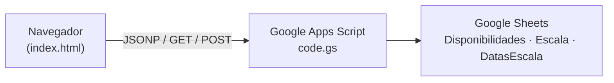

# Admin Evangelismo & Integração

Painel administrativo para montar, organizar e exportar a **escala mensal** do Ministério de Evangelismo & Integração. A aplicação combina uma interface web estática com backend em Google Apps Script e persistência em Google Sheets.

## Funcionalidades

- **Escala mensal** — quadro visual por data com voluntários escalados e líder do dia
- **Disponibilidades** — matriz de respostas dos membros (disponível, indisponível no mês, não respondeu, já escalado)
- **Geração automática** — monta a escala com base nas disponibilidades informadas
- **Gestão de datas** — criar, editar e remover datas do período ativo
- **Sidebar de membros** — busca, seleção e painel com datas disponíveis de cada pessoa
- **Líder por data** — definição de líder com duplo clique/toque na escala
- **Exportação PNG** — gera imagem da escala para compartilhamento
- **Sincronização em tempo real** — leitura e gravação via Google Sheets (Apps Script)
- **Layout responsivo** — menu lateral, abas no mobile e tema dark com detalhes dourados

---

## Arquitetura



| Camada | Tecnologia |
|--------|------------|
| Frontend | HTML, CSS e JavaScript vanilla |
| Backend | Google Apps Script (Web App) |
| Banco de dados | Google Sheets |
| Hospedagem | GitHub Pages (domínio customizado via `CNAME`) |

---

## Estrutura do repositório

```
admin-evangelismo/
├── index.html              # Aplicação completa (UI + lógica)
├── assets/                 # Imagens de fundo
├── apps-script/
│   └── code.gs             # API do Google Apps Script
├── CNAME                   # Domínio customizado (GitHub Pages)
└── README.md
```

---

## Pré-requisitos

- Conta Google com acesso ao Google Sheets e Apps Script
- Repositório no GitHub (para GitHub Pages) ou outro host de arquivos estáticos
- Navegador moderno (Chrome, Firefox, Edge, Safari)

---

## Configuração

### 1. Google Sheets

Crie uma planilha com as abas abaixo (podem ser criadas automaticamente pelo script):

| Aba | Função |
|-----|--------|
| `Disponibilidades` | Nome dos membros + colunas por data + coluna "Recebido em" |
| `Escala` | Registros de escala (Data, Nome, Função, Ministério, Lider) |
| `DatasEscala` | Configuração das datas do mês (key, label, full, day, hora) |

Copie o ID da planilha (trecho da URL entre `/d/` e `/edit`).

### 2. Google Apps Script

1. Abra [script.google.com](https://script.google.com) e crie um novo projeto
2. Cole o conteúdo de `apps-script/code.gs`
3. Altere `SHEET_ID` para o ID da sua planilha
4. Ajuste, se necessário, `ACTIVE_PERIOD`, `SCHEDULE_DATE_KEYS` e `getDefaultScheduleDates()`
5. Implante como **Aplicativo da Web**:
   - Executar como: **Eu**
   - Quem tem acesso: **Qualquer pessoa**
6. Copie a URL terminada em `/exec`

### 3. Frontend (`index.html`)

Atualize as constantes no início do bloco JavaScript:

```javascript
var SCRIPT_URL = 'https://script.google.com/macros/s/SEU_DEPLOY_ID/exec';
var ADMIN_USER = 'admin';
var ADMIN_PASS = 'sua_senha';
```

Opcionalmente, ajuste também:

- `DEFAULT_GROUP_DATES` — datas padrão do período
- `ACTIVE_PERIOD` — mês ativo no formato `YYYY-MM` (ex.: `2026-07`)
- `MEMBERS` — lista de membros do ministério
- `HIGHLIGHT_MEMBERS` — membros destacados na interface

> **Segurança:** a autenticação é feita no cliente (apenas para uso interno do painel). Para ambientes mais expostos, considere proteger o acesso por outro meio (ex.: autenticação no servidor ou restringir o deploy).

### 4. Publicação (GitHub Pages)

1. Faça push deste repositório para o GitHub
2. Em **Settings → Pages**, publique a branch `main` (pasta raiz `/`)
3. O arquivo `CNAME` aponta para `escala2.invbotafogo.com.br` — configure o DNS do domínio conforme a documentação do GitHub Pages

---

## Desenvolvimento local

Como é um site estático, basta servir a pasta raiz:

```bash
# Exemplo com Live Server (VS Code) — porta configurada em .vscode/settings.json
# Ou com Python:
python -m http.server 5501
```

Abra `http://localhost:5501` no navegador.

> Em localhost, as chamadas ao Google Apps Script dependem de CORS/JSONP já tratados no código. Certifique-se de que `SCRIPT_URL` aponta para um deploy válido.

---

## API (Apps Script)

Endpoints expostos via `doGet` / `doPost` (parâmetro `action`):

| Action | Descrição |
|--------|-----------|
| `getAll` | Lista disponibilidades de todos os membros |
| `getUsedNames` / `nomesOcupados` | Nomes já registrados na planilha |
| `getSchedule` / `setSchedule` | Lê ou grava a escala e líderes |
| `addPerson` / `removePerson` | Adiciona ou remove pessoa em uma data |
| `clearSchedule` | Limpa todos os registros da escala |
| `getDates` / `setDates` / `addDate` / `removeDate` | Gerencia datas do período |
| *(POST com `data`)* | Registra disponibilidades de um membro |

---

## Fluxo de uso

1. Membros informam disponibilidade (formulário externo → grava na aba `Disponibilidades`)
2. Administrador acessa o painel e faz login
3. Visualiza disponibilidades e monta a escala manualmente ou com **Gerar Escala Automática**
4. Define líderes por data, se necessário
5. Exporta PNG ou compartilha o quadro final

---

## Licença

Uso interno do ministério. Consulte o mantenedor do repositório antes de reutilizar em outros contextos.
